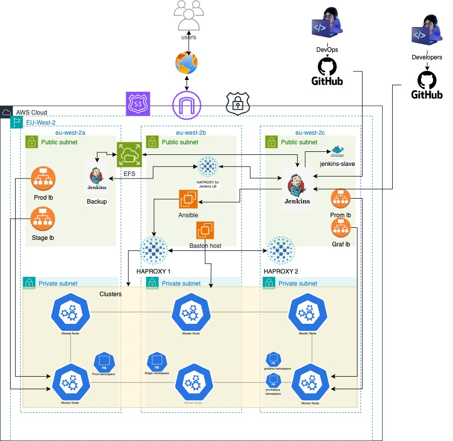

# Project Name - Kubernetes Project with Multi-Jenkins CICD
Project architectural diagram

## Introduction
This project involves creating a highly available, highly scalable microservice application using multi-master Kubernetes and master-slave Jenkins with a failover strategy.

This is a Kubernetes project using Kubeadm and Terraform as IAC (Infrastructure as Code) to build the infrastructure. 
This repository includes all terraform code. The README file will give step by step guide on how to deploy this project.

## Tech Stack
Infastructure as code (IAC) - Terraform
Cloud infrastructure - AWS Cloud Services
Version Control System - GitHub
Configuration Management - Ansible
Endpoint to cluster and Jenkins master-master lb- Haproxy
CICD Tool: Jenkins
Containerization: Docker, Kubernetes
Scripting: Bash/Shell Scripting
Monitoring Tools: grafana, prometheus
Operating Systems: Red Hat Linux, Ubuntu

## Prerequisites
Before you begin, make sure you have the following prerequisites:

An AWS account - You'll need an active AWS account to deploy resources using this Terraform code.
AWS CLI - Install the AWS Command Line Interface (CLI) on your local machine and configure it with your AWS credentials.
Terraform - Install Terraform on your local machine.
Git - Install Git on your local machine to clone this repository.
Create a AWS hosted zone on your AWS account and configure the DNS with your domain name

## Application Breakdown
This project aims to satisfy client requirements by creating a highly available, scalable microservice application.
The infrastructure was built using Terraform blocks Blocks in Terraform Provider Block, Data Block, Resource Block, Module Block, Variable Block, Output Block, and Locals Block.
We only provision all servers related to Jenkins on our local machine and the code is been pushed to the GitHub repo.

## Continous Integration and Continous Delivery (CICD) process
Jenkins was used in provisioning our application infrastructure to enhance continuous integration with a webhook trigger connected to our infrastructure GitHub repository for continuous delivery of any enhancement.

### Jenkins architecture
We create two master Jenkins with the same configuration. One as the main-master and the other is master-backup  to serve as a failover for the Jenkins master. 

We mount an Elastic File System (EFS) on both server pointing to the same directory. 

We used Haproxy with port binding 80 to direct traffic to the backup server if the main master is down.

For frequent updates of jobs run on the main master, we used the code below whose function is to reload and update the backup server.
```
curl -s -XPOST 'http://localhost:8080/reload' -u admin:11b93da95c141b9395b7da9412b977a879 -H "$(curl -s 'http://localhost:8080/crumbIssuer/api/xml?xpath=concat(//crumbRequestField,":",//crumb)' -u admin:admin)"

```
We generate an API token from the backup server, then use `$(curl -s 'http://localhost:8080/crumbIssuer/api/xml?xpath=concat(//crumbRequestField,":",//crumb)' -u admin:admin)` to generate jenkins crumb id from the backup server. The admin: admin signifies the username and password while `admin:11b93da95c141b9395b7da9412b977a879` signifies the username and API token respectively.
We create and paste this code into this directory `/opt/jenkins_reload.sh` and run this command `sudo chmod +x /opt/jenkins_reload.sh`

Also as part of resource management, we created a docker server to create jenkins-slaves to run Jenkins jobs. each container is killed once a job is completed.

# Code Deployment
To deploy this code successfully, kindly follow the below instructions.

# Section 1: Jenkins Deployment
## Step 1: Git repository cloning
You can clone the repository using the command below and navigate to the project directory.
```
git clone https://github.com/VictorA07/K8s-Project.git
``` 

## Step 2: Settings your credentials
Create and update this **variable.tfvars** below.
```
region =  "eu-west-2"
profile = " "
project-name =  " "
availability-zones = ["eu-west-2a", "eu-west-2b", "eu-west-2c"]
public-subnets = ["10.0.1.0/24", "10.0.2.0/24", "10.0.3.0/24"]
private-subnets = ["10.0.4.0/24", "10.0.5.0/24", "10.0.6.0/24"]
instance-type = ""
iam-policy-arn = "arn:aws:iam::aws:policy/AdministratorAccess"
ami-ec2 = " "
ami-ubuntu = " "
efs-port = 2049
ssh-port = 22
jenkins-port = 8080
```
# Step 3: Initialize Terraform and Deploying resources
Run the command to initialize Terraform and deploy our Jenkins resources.
### To initialize
```
terraform init -var-file=variable.tfvars -lock=false
```

### To plan the deployment
```
terraform plan -var-file=variable.tfvars -lock=false
```

### To Deploy
```
terraform apply -var-file=variable.tfvars -lock=false -auto-approve
```

### To Destroy
```
terraform destroy -var-file=variable.tfvars -lock=false -auto-approve
```

Some of the resources out needed in our application infrastructure main.tf will be populated. This is performed by a null resource block added to the Jenkins infrastructure main.tf file.

```
resource "null_resource" "credentials" {
  depends_on = [aws_instance.jenkins-server-active]
  provisioner "local-exec" {
    command = <<-EOT
      ids_output=$(terraform output)
      printf '%s\n' "$ids_output" | awk '{print "  " $0}' | sed '3r /dev/stdin' ../main.tf > tmpfile && mv tmpfile ../main.tf
    EOT 
  }
}
```

# Section 2: Infrastructure and Application deployment using Jenkins.

## Step 1: Jenkins setup
SSH into your Jenkins server and set up the following on both master and backup servers.
Required plugins - Terraform, AWS Credentials
Required credentials - AWS credentials (by adding our AWS access key and ID)
    - git credentials using username and password(git token)
    - Jenkins ssh credentials - creating ssh credentials user- ec2-user and add your jenkins primary keypair
    -Jenkins credentials - using username(Jenkins) and password(password)
Tools - Under Terraform - name- terraform, check Instal automatically, Type -linux amd64 
Under Admin - Configuration, Create an API token.
Use the token to create a webhook on your Github. paste the API token to the secret box below.


To setup jenkins-slave on docker;
Click on manage jenkins - Cloud - give it a name(e.g jenkins-slave)  - check Docker
follow the picture below for setup


In your pipeline, you can assign the job to the slave to run the job
```
any {
    label "jenkins-slave"
}
```

## Pipeline setup
Create a new item  or job
Select choice parameter
name= action
Choices = apply, destroy

choose github trigger
Add your github repository link
In your build, You can perform a terraform apply by choosing to apply and terraform destroy by choosing to destroy.
You can use your domain name with a specified prefix to access your application.


Kindly reach out for more information and feedback. 
Thank you.
